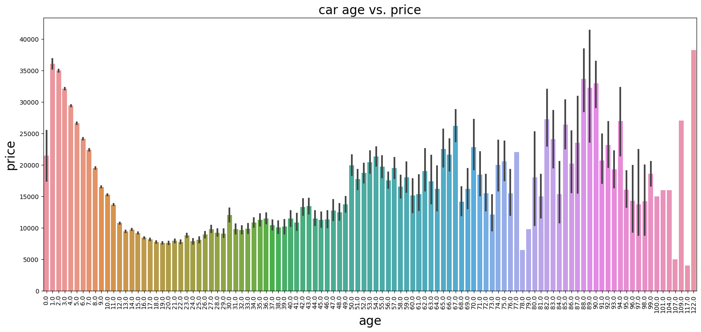
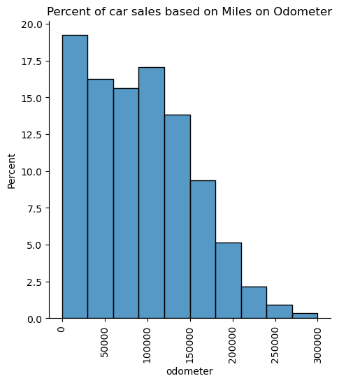

# Introduction
This analysis is prepared for used car dealers. It analyzes ~400k car sales data accross the country and identifies main drivers of price of a car.
By using this analysis, dealers can specifically target certain characteristics in a car, to maximize the sales price and revenue they generate.
We also will provide information about sales volumes in each category, so that, dealers can ensure there's supply of vehicles they are targeting for.

# What Drives Price of a Car?
By using advanced techniques, we analyzed 13 characteristics of cars that were sold in 2022. These characteristics are as follows:
- number of cylinders
- condition, manufacturer
- model
- fuel type
- title status
- transmission
- drive (4wd, fwd, rwd)
- paint color
- state the car is sold
- odometer
- age

Out of those, 3 characteristics are identified as main driver of a car's price:
- age
- cylinders
- odometer

To understand the effects of those variables better, we will share findings in subsequent sections.

## Age
Following plot summarizes how age affects a cars price.

As the car ages, it's price rapidly depreciates up until 20 years. However, beyond 20 years, it tends to increase, as it may be becoming a classic/vintage.

## Number of Cylinders
8 and 6 cylinder cars tend to have a higher price than lower number of cylinders

## Miles on Odometer
As the miles on the otometer increases, the price of the car drops for the majority of observed car sales.

# Car Supply Related to Age, Cylinders, Odometer
The majority of car sales were on cars 10 years or younger. As such, availability of supply shall not be an issue.

More than 60% of all cars sold were 6 cylinder. Given that 6 cylinder is sold at a premium than 4, dealers should focus on 6.

Given a choice between 8 and 4 cylinders, picking 8 will increase the price of the car.

Majority of the cars sold had less than 200,000 miles on the odometer. Roughly 40% of the cars has less than 50,000 miles, so there's plenty of supply on low milage.

# Conclusion

Three characteristics are identified as main driver of a car's price:
- age -> newer cars are sold at higher price
- cylinders -> higher number of cylinders are sold at a higher price than others
- odometer -> lower the odometer, higher the price

As presented, for the above characteristics, there's plenty of supply in the marketplace.

Going after above, car dealers will be able to maximize their used car sales revenue.
